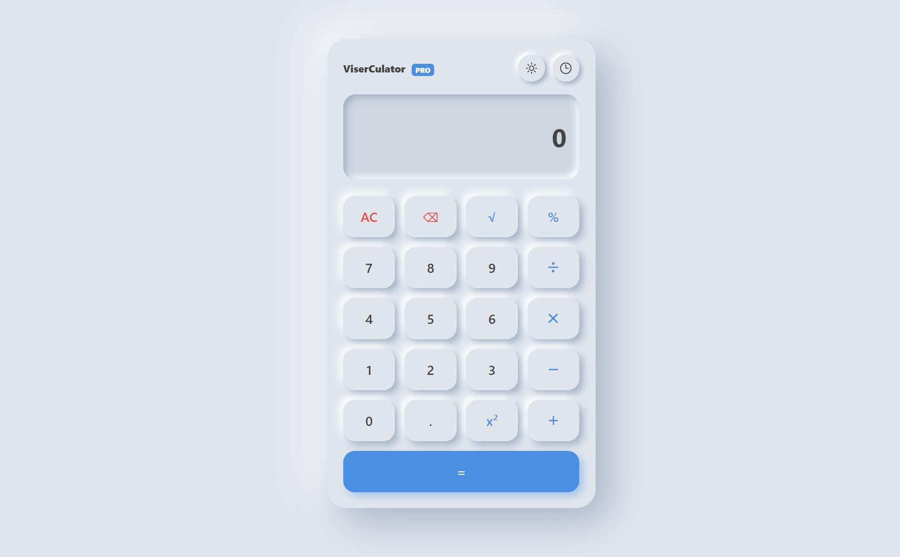
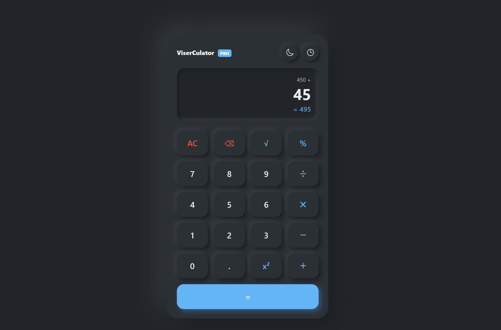
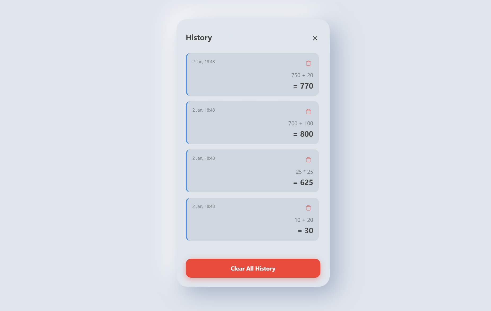

# ViserCulator - Smart Professional Calculator



**ViserCulator** is a high-performance, fully responsive web-based calculator built with **Vite** and **TypeScript**. It features a realistic "Neumorphism" 2D UI, tactile sound feedback, advanced history tracking, and day/night themes. Designed to work seamlessly across desktops, tablets, and mobile devices.

---

## ✨ Key Features

### 🎨 User Interface (UI/UX)
- **Realistic 2D Design:** Neumorphism style buttons with soft shadows and pressed states.
- **Responsive Layout:** Automatically adapts to Mobile, Tablet, and Desktop screens.
- **Theme Support:** Toggle between **Dark Mode** and **Light Mode** instantly.
- **Tactile Sound Effects:**
  - *Soft Click* for numbers.
  - *Mechanical Click* for operators.
  - Built using the **Web Audio API** (No external audio files required).

### 🧮 Calculation & Logic
- **Standard Operations:** Addition, Subtraction, Multiplication, Division.
- **Advanced Math:** Square Root (`√`), Power (`x²`), Percentage (`%`).
- **Chain Calculation:** Supports continuous operations (e.g., `12 + 10 - 5 * 2`).
- **Smart Formatting:**
  - Handles large numbers efficiently (Auto-formatting with commas).
  - Prevents overflow for long digits.
- **Error Handling:** Prevents "Divide by Zero" and invalid inputs.

### 📝 History Management
- **Persistent History:** Saves calculations in browser `localStorage`.
- **Detailed Log:** Shows date, time, expression, and result.
- **Interactive History:**
  - Delete individual history items.
  - **Clear All** button to wipe data.
  - Slide-up panel animation for mobile/desktop.

---

## 🛠️ Technology Stack

- **Core:** [Vite](https://vitejs.dev/) (Vanilla TypeScript Template)
- **Language:** TypeScript
- **Styling:** CSS3 (Variables, Flexbox, Grid, Media Queries)
- **Storage:** LocalStorage API
- **Audio:** Web Audio API

---

## 💻 Installation & Setup

Follow these steps to run the project locally on your machine.

### Prerequisites
Make sure you have **Node.js** installed.

### 1. Clone the Repository
```bash
git clone [https://github.com/visernic/viserCulator.git](https://github.com/visernic/viserCulator.git)
cd viserCulator
```

### 2. Install Dependencies
```bash
npm install
```

### 3. Run Development Server
```bash
npm run dev
```
Open your browser and visit: `http://localhost:5173`

### 4. Build for Production
```bash
npm run build
```

---

## 📂 Project Structure

```text
viserCulator/
├── public/
│   ├── demo-preview-image.jpg  # Preview Image
│   └── visernic.svg
├── src/
│   ├── main.ts       # Core Logic (Calculator Class, Sound, History)
│   ├── style.css     # Styling (Responsive, Dark Mode, Neumorphism)
│   └── vite-env.d.ts
├── index.html        # HTML Structure
├── package.json
├── tsconfig.json
└── README.md
```

---

## 📸 Screenshots

| Light Mode | Dark Mode | History Panel |
|:---:|:---:|:---:|
|  |  |  |

---

## 🤝 Contributing

Contributions are welcome! If you have any suggestions to make **ViserCulator** better:

1. Fork the repository.
2. Create your feature branch (`git checkout -b feature/AmazingFeature`).
3. Commit your changes (`git commit -m 'Add some AmazingFeature'`).
4. Push to the branch (`git push origin feature/AmazingFeature`).
5. Open a Pull Request.

---

## 👤 Author

**Visernic Limited** - GitHub: [@visernic](https://github.com/visernic)
- Website: [visernic.com](https://visernic.com)

---

## 📄 License

This project is licensed under the **MIT License**.
